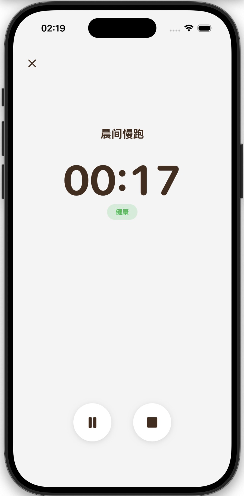
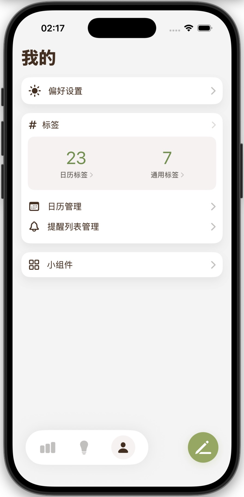

# Chrono — 时间线任务管理

[](https://dhnihaoya.github.io/ChronoWebsite/)

Chrono 是一款 iOS 应用，采用**时间线视图**来组织日常任务与提醒，让每一刻都井然有序。

本项目是 Chrono 的**官方网站**，托管于 GitHub Pages，用于 App Store 技术支持、营销展示以及隐私政策和使用条款的公开页面。

👉 **[在线访问](https://dhnihaoya.github.io/ChronoWebsite/)**

---

## 功能亮点

- 🌍 **多语言支持**：自动检测浏览器语言，支持中文/英文切换
- 📱 **响应式设计**：完美适配桌面、平板和手机
- 🎨 **现代化设计**：与 Chrono 应用风格保持一致
- 🖼️ **真实截图**：集成应用实际截图展示
- ⚡ **流畅动画**：悬停效果和过渡动画

## 应用截图

| 主页面 | 添加任务 | 专注模式 | 数据洞察 | 个人中心 |
|--------|----------|----------|----------|----------|
|  |  |  |  |  |

## 本地预览

本项目为纯静态网站，无需构建。在本地启动任意静态文件服务器即可：

```bash
python3 -m http.server 8000
```

然后在浏览器中访问 `http://localhost:8000`。

## GitHub Pages 部署

1. 进入 GitHub 仓库页面，点击 `Settings`
2. 在左侧菜单中找到 `Pages`
3. 在 `Build and deployment` 部分：
   - Source: 选择 `Deploy from a branch`
   - Branch: 选择 `main` 分支，目录选择 `/`
   - 点击 `Save` 保存
4. 等待几分钟后，网站将发布在 `https://dhnihaoya.github.io/ChronoWebsite/`

## 问题反馈

如果你在使用 Chrono 或访问网站时遇到任何问题、发现错误，或有功能建议，欢迎通过以下方式联系我们：

- 🐛 **提交 GitHub Issue**：请在 [Issues](https://github.com/dhnihaoya/ChronoWebsite/issues) 页面创建新的 Issue，描述你遇到的问题或建议
- 📧 **发送邮件**：[chronoapp@163.com](mailto:chronoapp@163.com)

## 隐私与条款

- [隐私政策](https://dhnihaoya.github.io/ChronoWebsite/privacy.html)
- [使用条款](https://dhnihaoya.github.io/ChronoWebsite/terms.html)

## 致谢

- 由 Chrono 团队维护
- 使用 GitHub Pages 托管
