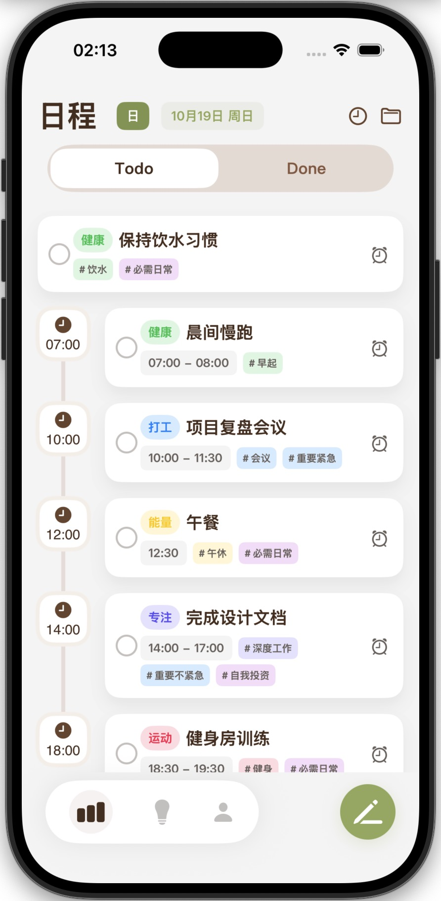
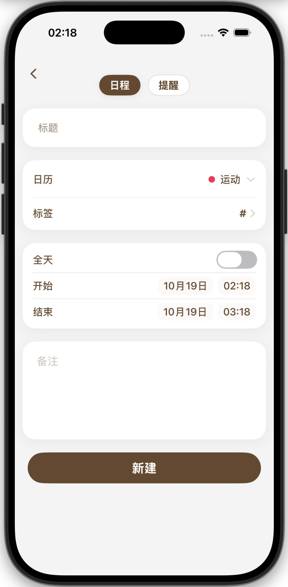
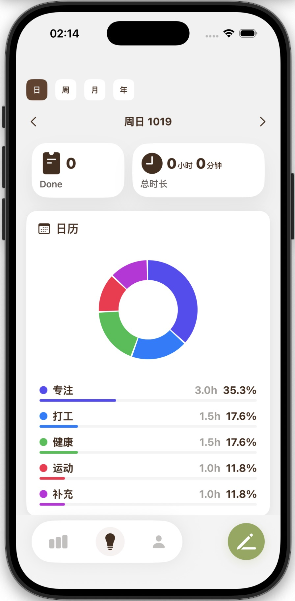

# Chrono - 时间线任务管理

Chrono 是一款面向 iPhone 的时间线任务管理应用。它把日程、提醒事项、专注记录和时间洞察放在同一条清晰的时间线上，帮助你更自然地规划今天、回顾过去，并持续优化自己的时间分配。

**访问官网：** <https://dhnihaoya.github.io/Chrono/>

**App Store 下载：** <https://apps.apple.com/cn/app/chrono/id6753885021>

**UI设计：** 1176180038@qq.com

## 为什么选择 Chrono

很多任务管理工具把待办、日历、提醒和专注记录分散在不同入口。Chrono 的核心思路是把它们重新组织成一条时间线：你可以直观看到今天要做什么、每件事发生在什么时候、哪些任务已经完成，以及自己的时间被投入到了哪里。

Chrono 适合想要用更少整理成本管理日程、提醒事项和专注时间的用户。

## 功能亮点

- **时间线视图**：按时间组织日程、提醒和任务状态，让一天的安排更直观。
- **日程与提醒管理**：支持分类、标签、备注、完成状态以及不同时间类型的任务。
- **Apple 生态集成**：可与 Apple 日历和提醒事项协同使用。
- **专注模式**：记录专注时段，并将专注成果沉淀为可回顾的数据。
- **数据洞察**：通过统计视图理解时间分配和使用习惯。
- **快捷计时小组件**：在主屏幕快速启动常用专注项目。
- **Live Activity**：在进行中的专注会话里获得更轻量的状态提醒。
- **浅色与吸血鬼模式**：支持浅色外观和 Dracula 风格深色外观，适配白天和夜间使用。

## 应用预览

| 首页时间线 | 添加任务 | 专注模式 | 数据洞察 | 个人中心 |
| --- | --- | --- | --- | --- |
|  |  |  |  |  |

## 技术支持与反馈

如果你在使用 Chrono 或访问官网时遇到问题，欢迎优先通过 GitHub Issue 反馈：

- [提交使用问题或功能建议](https://github.com/dhnihaoya/ChronoWebsite/issues)
- 技术支持邮箱：<chronoapp@163.com>
- UI设计：1176180038@qq.com

提交 Issue 时，建议包含以下信息，方便定位问题：

- 你遇到的问题或期望的改进。
- 操作步骤、截图或录屏。
- iOS 版本、设备型号，以及 Chrono 版本号。

## 隐私与条款

- [隐私政策](https://dhnihaoya.github.io/Chrono/privacy.html)
- [使用条款](https://dhnihaoya.github.io/Chrono/terms.html)

Chrono 尊重用户隐私。根据当前隐私政策，应用不收集个人信息，不使用第三方分析或广告追踪，任务数据保存在用户设备本地。

## 关于这个网站

本仓库用于维护 Chrono 的官方网站、技术支持页面、隐私政策和使用条款。网站为纯静态页面，通过 GitHub Pages 发布。
