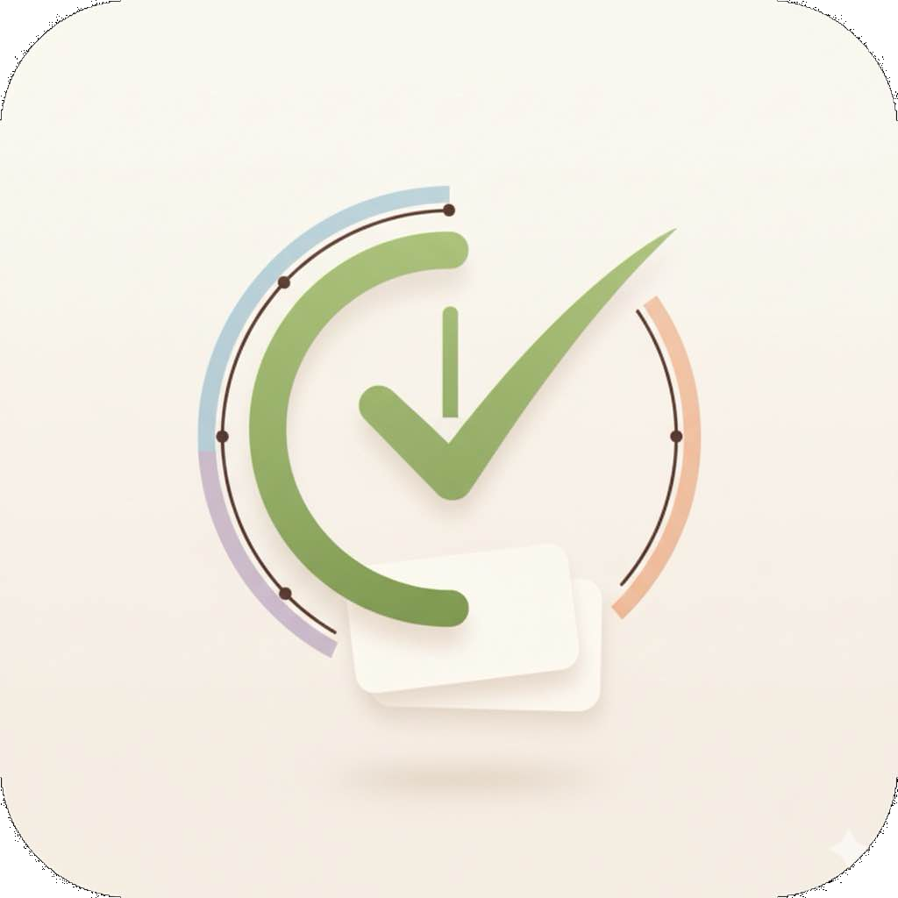
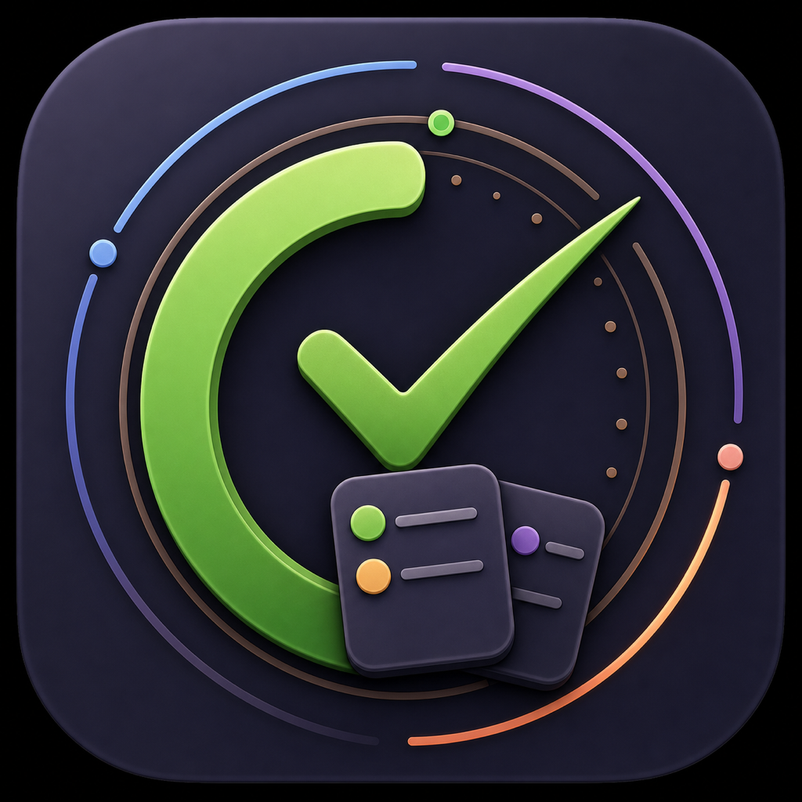
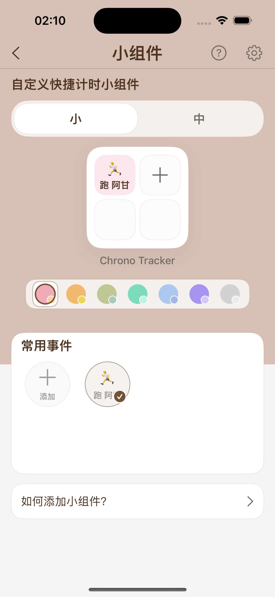
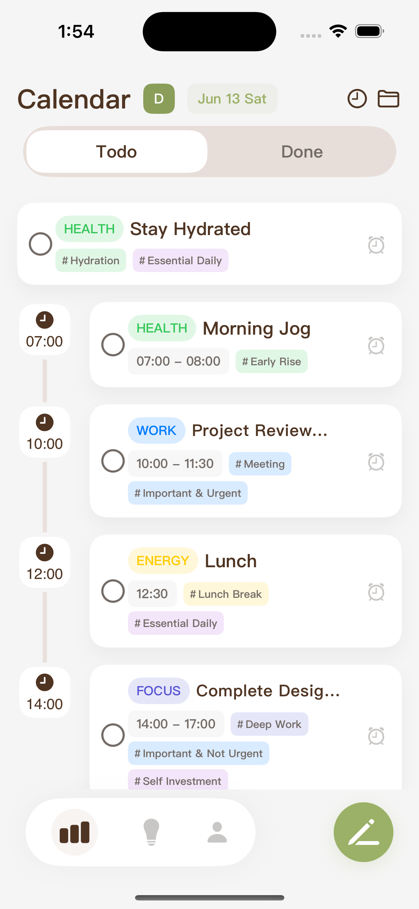
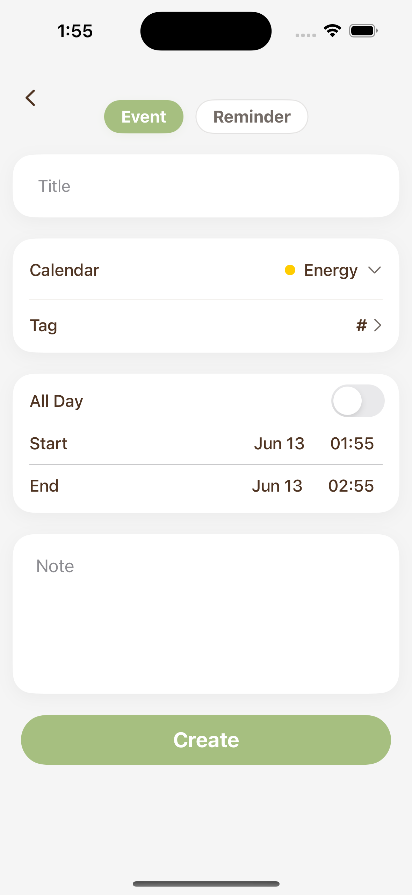
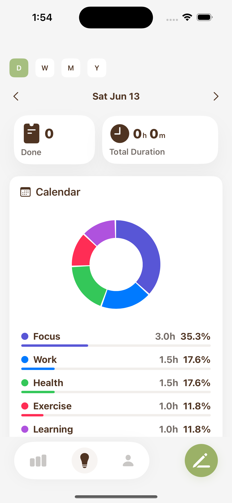
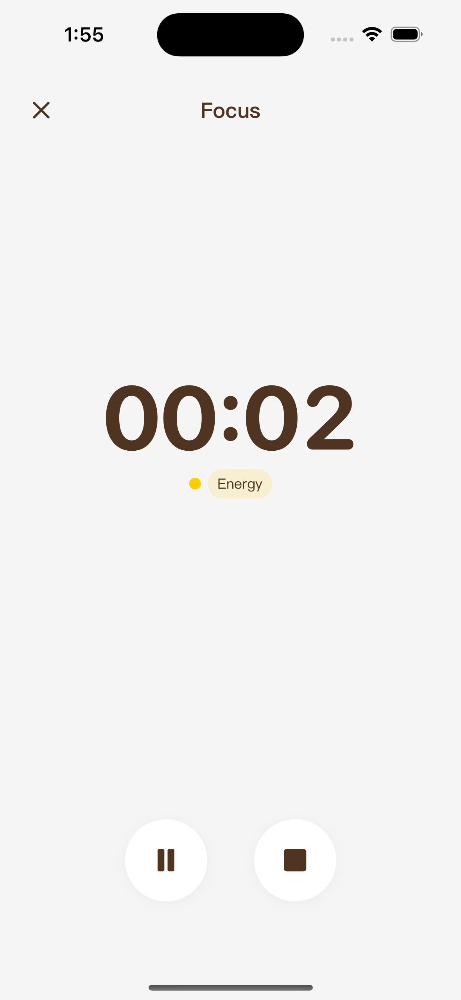
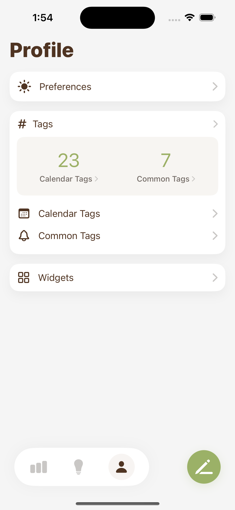
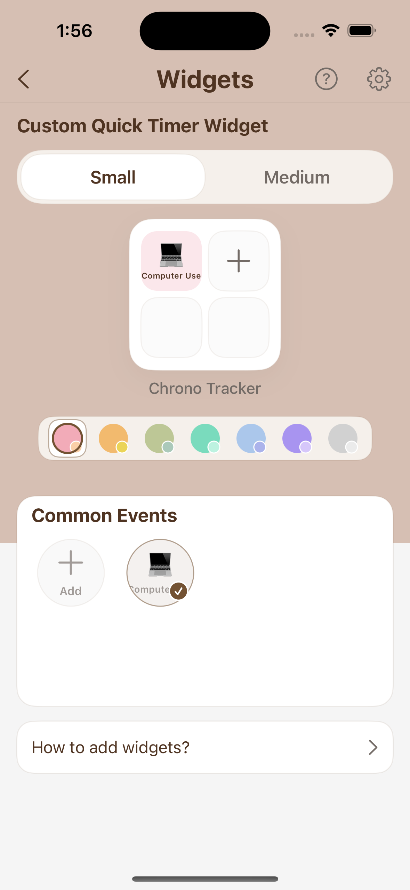

  
  &nbsp;&nbsp;
  

<h1 align="center">Chrono</h1>

  <strong>今天做什么，几点开始。</strong>
   
  把日程、提醒事项、专注记录和时间洞察放回同一条时间线。

  <a href="https://dhnihaoya.github.io/Chrono/">官网</a>
  ·
  <a href="https://apps.apple.com/cn/app/chrono/id6753885021">App Store</a>
  ·
  <a href="https://github.com/dhnihaoya/Chrono/issues">反馈问题</a>
  ·
  <a href="#zh">中文</a>
  ·
  <a href="#en">English</a>

  UI 设计：<a href="mailto:1176180038@qq.com">1176180038@qq.com</a> · 支持邮箱：<a href="mailto:chronoapp@163.com">chronoapp@163.com</a>

  Light · Dracula · Timeline-first productivity for iPhone

---

## 中文

Chrono 是一款面向 iPhone 的时间线任务管理应用。它把待办、日历、提醒事项和专注计时重新整理成一条清晰的时间线，让你不用在几个 App 之间来回切换，也能快速判断下一步该做什么。

### 为什么是 Chrono

很多工具只告诉你“有多少事要做”，Chrono 更关心“这些事在时间里怎么发生”。你可以先看一天的顺序，再处理每个任务；开始专注后，记录也会留在同一个时间上下文里，方便回看和调整。

<table>
  <tr>
    <td><strong>时间线视图</strong> 按时间查看今天、本周和未来安排。</td>
    <td><strong>提醒事项集成</strong> 把 Apple 提醒事项放进同一个工作流。</td>
    <td><strong>日历同步</strong> 会议、安排和任务一起看。</td>
  </tr>
  <tr>
    <td><strong>专注模式</strong> 开始专注、记录时长、沉淀回顾数据。</td>
    <td><strong>数据洞察</strong> 看清时间投入，调整下一周安排。</td>
    <td><strong>快捷小组件</strong> 在主屏幕快速启动常用专注项目。</td>
  </tr>
  <tr>
    <td><strong>Live Activity</strong> 在专注进行中获得轻量状态提醒。</td>
    <td><strong>分类与标签</strong> 用颜色和标签区分工作、健康与生活。</td>
    <td><strong>浅色与 Dracula</strong> 适配白天、夜间和不同视觉偏好。</td>
  </tr>
</table>

### 应用预览

截图会跟随浏览器深浅色显示偏好自动切换。

| 时间线 | 添加任务 | 数据洞察 |
| --- | --- | --- |
| <picture><source media="(prefers-color-scheme: dark)" srcset="assets/dark/zh/main.png"></picture> | <picture><source media="(prefers-color-scheme: dark)" srcset="assets/dark/zh/add_schedule.png"></picture> | <picture><source media="(prefers-color-scheme: dark)" srcset="assets/dark/zh/insight.png"></picture> |

| 专注 | 个人中心 | 小组件 |
| --- | --- | --- |
| <picture><source media="(prefers-color-scheme: dark)" srcset="assets/dark/zh/focus.png"></picture> | <picture><source media="(prefers-color-scheme: dark)" srcset="assets/dark/zh/mine.png"></picture> | <picture><source media="(prefers-color-scheme: dark)" srcset="assets/dark/zh/widgets.png"></picture> |

### 下载与反馈

- 官网：<https://dhnihaoya.github.io/Chrono/>
- App Store：<https://apps.apple.com/cn/app/chrono/id6753885021>
- 使用问题、网站错误和功能建议：<https://github.com/dhnihaoya/Chrono/issues>
- 技术支持邮箱：<chronoapp@163.com>
- UI 设计：<1176180038@qq.com>

提交反馈时，建议附上问题描述、操作步骤、截图或录屏，以及 iOS 版本、设备型号和 Chrono 版本号。

### 隐私与条款

- [隐私政策](https://dhnihaoya.github.io/Chrono/privacy.html)
- [使用条款](https://dhnihaoya.github.io/Chrono/terms.html)

Chrono 尊重用户隐私。根据当前隐私政策，应用不收集个人信息，不使用第三方分析或广告追踪，任务数据保存在用户设备本地。

---

## English

Chrono is a timeline task management app for iPhone. It brings tasks, calendar events, reminders, focus sessions, and time insights into one clear timeline, so you can stop jumping between apps and quickly understand what comes next.

### Why Chrono

Many productivity tools show how many tasks you have. Chrono focuses on how those tasks happen across time. You can scan the order of the day first, act on each item in context, and keep focus records where they belong: alongside the schedule they came from.

<table>
  <tr>
    <td><strong>Timeline View</strong> See today, this week, and upcoming plans in order.</td>
    <td><strong>Reminders Integration</strong> Bring Apple Reminders into the same workflow.</td>
    <td><strong>Calendar Sync</strong> View events, plans, and tasks together.</td>
  </tr>
  <tr>
    <td><strong>Focus Mode</strong> Start focused sessions and keep reviewable records.</td>
    <td><strong>Time Insights</strong> Understand time allocation and adjust your week.</td>
    <td><strong>Quick Widgets</strong> Launch common focus projects from the Home Screen.</td>
  </tr>
  <tr>
    <td><strong>Live Activity</strong> Keep lightweight progress context while focusing.</td>
    <td><strong>Categories and Tags</strong> Separate work, health, and life with color.</td>
    <td><strong>Light and Dracula</strong> Built for daytime, nighttime, and different preferences.</td>
  </tr>
</table>

### Preview

Screenshots follow the browser's light or dark display preference automatically.

| Timeline | Add Task | Insights |
| --- | --- | --- |
| <picture><source media="(prefers-color-scheme: dark)" srcset="assets/dark/en/main.png"></picture> | <picture><source media="(prefers-color-scheme: dark)" srcset="assets/dark/en/add_schedule.png"></picture> | <picture><source media="(prefers-color-scheme: dark)" srcset="assets/dark/en/insight.png"></picture> |

| Focus | Profile | Widgets |
| --- | --- | --- |
| <picture><source media="(prefers-color-scheme: dark)" srcset="assets/dark/en/focus.png"></picture> | <picture><source media="(prefers-color-scheme: dark)" srcset="assets/dark/en/mine.png"></picture> | <picture><source media="(prefers-color-scheme: dark)" srcset="assets/dark/en/widgets.png"></picture> |

### Download and Support

- Website: <https://dhnihaoya.github.io/Chrono/>
- App Store: <https://apps.apple.com/cn/app/chrono/id6753885021>
- Questions, website issues, and feature requests: <https://github.com/dhnihaoya/Chrono/issues>
- Support email: <chronoapp@163.com>
- UI Design: <1176180038@qq.com>

When reporting an issue, please include what happened, reproduction steps, screenshots or screen recordings, your iOS version, device model, and Chrono version when possible.

### Privacy and Terms

- [Privacy Policy](https://dhnihaoya.github.io/Chrono/privacy.html)
- [Terms of Use](https://dhnihaoya.github.io/Chrono/terms.html)

Chrono respects user privacy. Based on the current privacy policy, the app does not collect personal information, does not use third-party analytics or advertising trackers, and keeps task data locally on the user's device.
